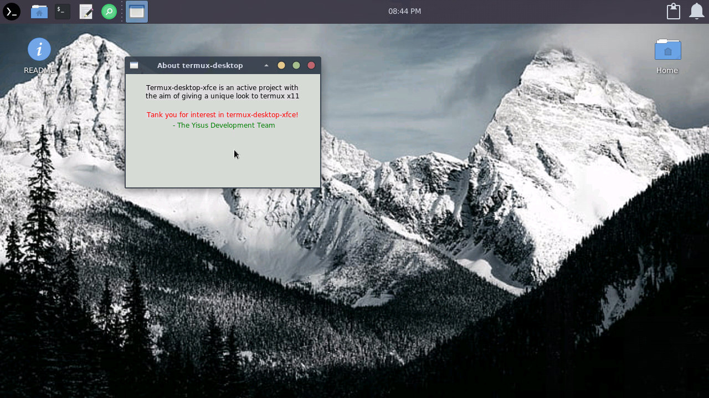
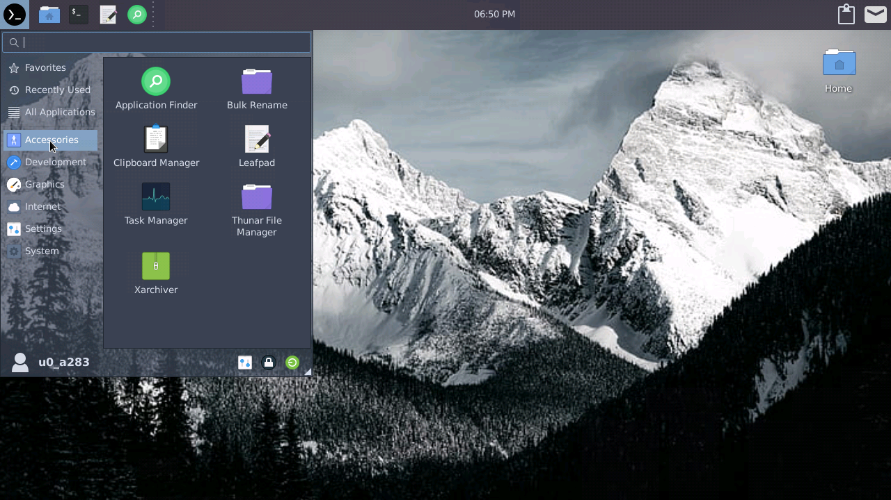

# termux-desktop-xfce
Set up a beautiful xfce desktop in termux 

# Que es? 

Esto es una configuración avanzada de termux x11, 
rica en funciones para ser altamente funcional,
con un aspecto atractivo, altamente personalizable
y con una optimización muy buena, esto fue 
inspirado en :

https://github.com/WMCB-Tech/dotfiles

Y

https://github.com/adi1090x/termux-desktop

Haciendo como resultado un escritorio altamente
útil y optimizado. 

# capturas de pantalla :

> Nota: Este escritorio se ejecuta bajo termux 
x11, no es una distribución proot

# Eche un vistazo a las utilidades preinstaladas

### --visor de procesos y reproductor de música

### --navegue en la web, edite sus archivos con Gvim,
leafpad, y chatee en canales irc con hexchat

 
 

### --programe con un buen autocompletado y resaltado de sintaxis con geany

### --Juege juegos retro o ejecute windows 1, 2 o 3
en el emulador dosbox

> pocas apps?, e echo una configuración para 
> ejecutar las apps de una distro proot en termux x11! 
> Un ejemplo :

./start-ubuntu.sh

apt install firefox

export DISPLAY=:1

firefox 

### puede ejecutar apps proot sin problemas

 
 
 

# instalación 

⚠ Solo en termux 

cd $HOME

pkg update && pkg upgrade 

pkg install git 

pkg install wget 

git clone https://github.com/Yisus7u7/termux-desktop-xfce

cd termux-desktop-xfce

bash install-desktop-xfce.sh

> luego de eso solo espere, el script hará su trabajo 

# Uso 

usa el comando :

startdesktop 

O

vncserver -listen tcp 

Pará iniciar el servidor vnc, conectese a localhost:1
O el puerto que haya indicado la terminal 

Cualquier error, pregunta o sujerencia reportala en :
https://github.com/Yisus7u7/termux-desktop-xfce/issues

## Actualizar 

`Espero que te guste este pequeño trabajo,
No olvides dejar tu 🌟 y compartir :3`

